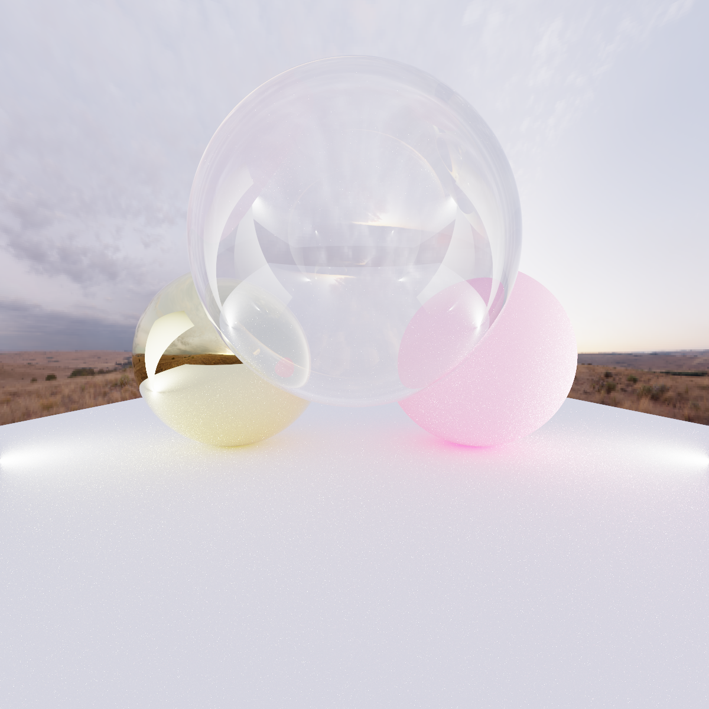

# rayt

simple pathtracer written in rust

# Usage

Use help to get the command line options

```
cargo run -r -- --help
```

# Example

```
cargo run -r -- -s 1024 -r 1200 --hdr-path <path/to/hdr/image.hdr>  && feh img.ppm 
```

## Renders



